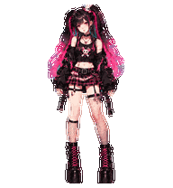

# Pink Riot — Animated ChatGPT Pet

**An animated anime-punk companion for ChatGPT Pets, created entirely using ChatGPT, with Codex used for asset assembly and quality checks.** This repository contains the actual working pet assets, not a mockup or an independently generated replacement.

[**Download the ready-to-upload WebP**](Pink-Riot-web-upload.webp) · [PNG alternative](Pink-Riot-web-upload.png) · [Русская инструкция](README.ru.md)

  

## Install in ChatGPT

1. In ChatGPT, open **Settings → Personalization → Pet → Select pet → Upload pet** (if available for your account).
2. Download **[Pink-Riot-web-upload.webp](Pink-Riot-web-upload.webp)** or the [PNG version](Pink-Riot-web-upload.png).
3. Upload **one** of these files. Do **not** upload the extended v2 sheet into the standard web uploader.
4. Select Pink Riot and enjoy. The finished pet has been successfully imported and tested in ChatGPT by its creator.

## What's included

| File | Purpose |
|---|---|
| `Pink-Riot-web-upload.webp` / `.png` | Transparent 1536 × 1872 sheet for ChatGPT web upload; choose one |
| `spritesheet.webp`, `spritesheet-v2.png`, `pet.json` | Extended 1536 × 2288 v2 package with look directions |
| `previews/` | Actual animated GIF/WebP clips for all nine animation states and look directions |
| `preview.html` | Local interactive animation viewer (open after downloading the repo) |
| `contact-sheet.png`, `look-directions.png` | Full animation overview and 16 look directions |
| `sources/frames/`, `sources/references/`, `sources/prompts/` | Raster source frames, original character master and creation prompts |

The nine states comprise idle, movement right, movement left, wave, jump, failure, waiting, working/thinking and review: **57 animation frames** in total. The v2 package also supplies **16 look directions**. The web sheet has 9 rows; the extended v2 sheet has 11 rows.

## Preview

  

For finer transparency and edges, use the matching lossless WebP clips in [`previews/`](previews/). GIF is provided for convenient GitHub display.

## Notes

The primary PNG/WebP web atlas is 1536 × 1872. The v2 atlas is 1536 × 2288 and is **not** the web upload file. Some intermediate diagonal look directions are subtly distinct. The final imported pet was tested by the creator in ChatGPT. The source material is raster artwork, not a Live2D or 3D rig.

## Credits and usage

Character design, image assets, animations and assembly were created entirely with **ChatGPT**, including image generation and Codex-assisted production/QA. The original look is based on the creator-approved Pink Riot master sheet; third-party inspiration images are not included.

**Please credit this repository if you share or modify Pink Riot.** No open-source license is granted by this repository until the creator chooses one; do not assume redistribution or commercial rights beyond the files explicitly shared here.

This is an independent community project, not an official OpenAI release. ChatGPT is a trademark of OpenAI.
