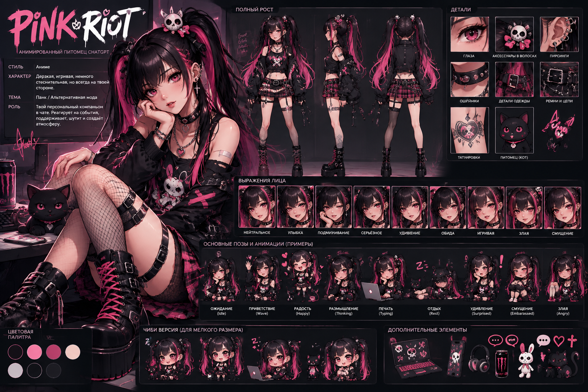
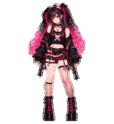
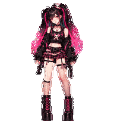
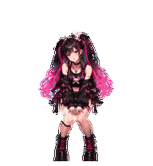
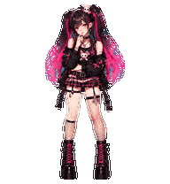
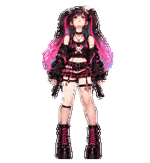

# Pink Riot

[English](README.md) · **Created entirely using ChatGPT & Codex**

Аниме-панк героиня с чёрно-розовыми хвостами, платформенными ботинками и характером. Автор подтвердил, что питомец работает в ChatGPT.

### Скачать → загрузить → выбрать Pink Riot

**[Скачать питомца — WebP](https://github.com/Brut992/pink-riot-chatgpt-pet/releases/download/v1.0.0/Pink-Riot-web-upload.webp)** · [Вариант PNG](https://github.com/Brut992/pink-riot-chatgpt-pet/releases/download/v1.0.0/Pink-Riot-web-upload.png) · [Все файлы релиза](https://github.com/Brut992/pink-riot-chatgpt-pet/releases/tag/v1.0.0)

1. Скачайте **один** из двух файлов питомца выше.
2. В ChatGPT откройте **Settings → Personalization → Pet → Select pet → Upload pet**, если функция доступна.
3. Загрузите файл и выберите **Pink Riot**.

Файл для загрузки: прозрачный атлас **1536 × 1872**, меньше 20 МиБ. [Официальная инструкция](https://learn.chatgpt.com/docs/pets). Расширенный v2-атлас выше по размеру и предназначен для совместимых настольных инструментов; для веб-загрузки используйте основную ссылку.

### Настоящие анимации

| Покой | Приветствие | Прыжок |
| :---: | :---: | :---: |
|  |  |  |

 

Это кадры самого питомца. [Все девять анимаций и взгляды](previews/) также доступны в WebP с полупрозрачными краями. Размышление соответствует рабочему состоянию `running`; отдельного Happy в наборе нет.

### Что внутри

- `Pink-Riot-web-upload.webp` / `.png` — файл для установки, выберите один.
- `spritesheet.webp`, `spritesheet-v2.png`, `pet.json` — расширенный v2: 57 кадров, 16 взглядов и нейтральная поза.
- [preview.html](preview.html) — скачайте ZIP репозитория, распакуйте и откройте этот файл для интерактивного просмотра.
- [Полный атлас](spritesheet-v2.png) и [все взгляды](look-directions.png).
- `sources/` — отдельные RGBA-кадры, принятые исходные полосы и опорный спрайт. Это растровые исходники, не многослойный риг.
- `assets/` — оригинальный утверждённый мастер-дизайн. Сторонние референсы не включены.
- [Отчёт о проверках](QA.md) и [контрольные суммы](SHA256SUMS).

### Создание и права

**Created entirely using ChatGPT & Codex.** Изображения, анимации, сборка и проверки созданы этими инструментами на основе утверждённого дизайна Pink Riot.

Открытая лицензия не назначена: [условия](LICENSE-NOTICE.md). Независимый пользовательский проект, не официальный продукт OpenAI.
